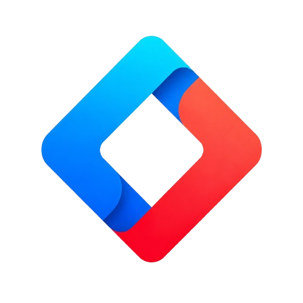

`Pro Components of Vue` 是基于 Pro Components(React) 的 Vue 实现，提供了许多的高阶组件，帮助开发者快速构建现代化的 Web 应用。

<div class="pic-plus">
  
  <span>+</span>
  
  <span>=</span>
  
</div>

---

## ✨ 特性

- 🌈 提炼自企业级中后台产品的交互语言和视觉风格。
- 📦 开箱即用的高质量 Vue3 组件。
- 🛡 使用 TypeScript 开发，提供完整的类型定义文件。
- ⚙️ 共享<a href="https://ant.design/docs/resources-cn" target="_blank" rel="noopener noreferrer"> Ant Design of React </a>设计资源体系。
- 🌍 数十个国际化语言支持。
- 🎨 深入每个细节的主题定制能力。

## 兼容环境

- 现代浏览器
- 支持服务端渲染。
- [Electron](https://www.electronjs.org/)

| [](https://godban.github.io/browsers-support-badges/)</br>Edge | [](https://godban.github.io/browsers-support-badges/)</br>Firefox | [](https://godban.github.io/browsers-support-badges/)</br>Chrome | [](https://godban.github.io/browsers-support-badges/)</br>Safari | [](https://godban.github.io/browsers-support-badges/)</br>Opera | [](https://godban.github.io/browsers-support-badges/)</br>Electron |
| --- | --- | --- | --- | --- | --- |
| Edge | last 2 versions | last 2 versions | last 2 versions | last 2 versions | last 2 versions |

> `vue3` 之后不再支持 IE8。 `antdv-next` 默认不支持 IE。推荐从`vue@3.5.x`版本开始使。

## 版本

- 稳定版：[](https://www.npmjs.org/package/antdv-next)

## 安装

### 使用 npm 或 yarn 或 pnpm 或 bun 安装

**我们推荐使用 [npm](https://www.npmjs.com/) 或 [yarn](https://github.com/yarnpkg/yarn/) 或 [pnpm](https://pnpm.io/zh/) 或 [bun](https://bun.sh/) 的方式进行开发**，不仅可在开发环境轻松调试，也可放心地在生产环境打包部署使用，享受整个生态圈和工具链带来的诸多好处。

<InstallDependencies npm='$ npm install @antdv-next1/pro-components --save' yarn='$ yarn add @antdv-next1/pro-components' pnpm='$ pnpm install @antdv-next1/pro-components --save' bun='$ bun add @antdv-next1/pro-components'></InstallDependencies>

如果你的网络环境不佳，推荐使用 [cnpm](https://github.com/cnpm/cnpm)。


## 示例

```vue
<script setup lang="ts">
import { ProForm, ProFormText } from '@antdv-next1/pro-components'

function handleSubmit(values: Record<string, any>) {
  console.log(values)
}
</script>

<template>
  <ProForm @finish="handleSubmit">
    <ProFormText name="name" label="Name" :rules="[{ required: true }]" />
    <ProFormText name="email" label="Email" />
  </ProForm>
</template>
```


### TypeScript

`pro-components` 使用 TypeScript 进行书写并提供了完整的定义文件。

## 链接

- [首页](/index-cn)
- [所有组件](/components/overview-cn)
